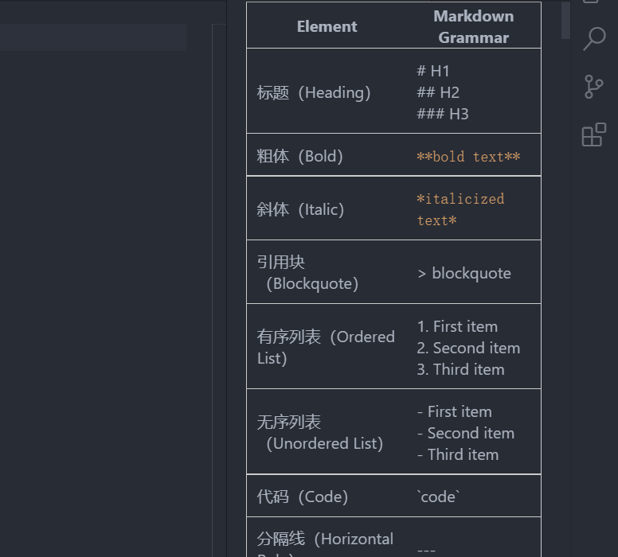

# Markdow-Grammer-Hint
give you the markdown grammer hint and emoji

## Usage
After Install, just click your right mouse button and choose markdow grammer hint command in the table

so, you can follow the right side info to write markdow 😃
## Preview

